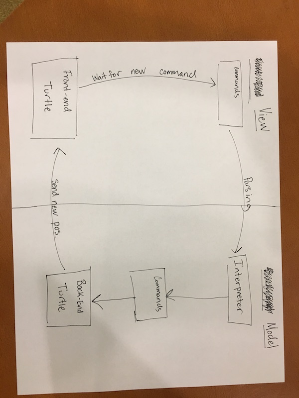

SLogo APIs
=========

Parsing needs to take place whenever the user has input a valid command into the text box and has pressed enter or clicked on a "run" button. For now, we will disable parsing while a command is being run by preventing the user from running more commands in that time.

The turtle receives the result of parsing, and it translates that into movements. The Model will specify how the turtle will move according to the parsing, and the View will update the turtle's placement. The program will not allow syntax errors to be parsed, instead it will tell the user that there is an error with the written code. If a user inputs a command that would force the turtle to move off the screen, the turtle will just move as far as it can without moving of the screen, and the user will be informed of the mistake. 

Commands need to know the current state of the turtle, including its position and orientation. The commands will get the current state when the "enter" key is pressed, and this method will be part of the external API. The front-end internal API will parse the text into commands which will then be fed into the Model through an external API. At this point, the Model interprets the commands and updates the currents state of the turtle accordingly. The external Model API then relays the information about the new state to the View, which then graphically updates the state of the turtle. 

### Here is a picture of our dependencies:

